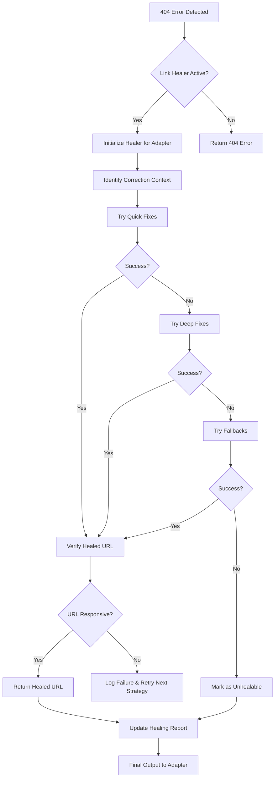

# LINK HEALER VISUAL GUIDE

This guide explains the internal logic and workflow of the Link Healer system.

## 🔄 The Healing Workflow

## 🧠 Decision Logic (Strategy Priority)

| Priority | Strategy | Logic | Cost |
|:---:|:---|:---|:---:|
| 1 | **Pattern Fix** | Regex cleanup of common URL typos. | ⚡ Low |
| 2 | **Date Correction** | Rotate YYYY-MM-DD to YYYYMMDD and others. | ⚡ Low |
| 3 | **Param Adjust** | Re-encode query strings with known good context. | ⚡ Low |
| 4 | **Homepage Crawl** | BeautifulSoup scan of homepage for link patterns. | 🐢 High |
| 5 | **Domain Search** | Guess-and-check common domain path structures. | ⏱️ Med |
| 6 | **Fallback API** | Switch from HTML scraping to API endpoint. | ⏱️ Med |

## 📊 Before vs. After Link Healer

### Scenario: Equibase Date Mismatch
- **Input URL:** `https://equibase.com/races/2025-01-29/GP` → **404**
- **Correction:** Healer identifies date `2025-01-29` and tries `20250129`.
- **Healed URL:** `https://equibase.com/races/20250129/GP` → **200 OK** ✅

### Scenario: Broken Racing Post Path
- **Input URL:** `https://racingpost.com/racing/cards/bad-path` → **404**
- **Correction:** Healer crawls homepage, finds "Today's Racing" link.
- **Healed URL:** `https://racingpost.com/horse-racing/racecards/2025-01-29` → **200 OK** ✅

## 🛠️ Troubleshooting

### Why did healing fail?
1. **No patterns defined:** The adapter might not have `patterns` configured in `ADAPTER_DOMAINS`.
2. **Context missing:** If `date` or `venue` isn't provided in the context, strategies like `Date Correction` cannot run.
3. **Site offline:** If the domain itself is down, Link Healer will fail all verifications.
4. **Heavy bot detection:** If the site blocks the HEAD request used for verification, the healer will assume the URL is bad.

### How to improve recovery rates?
- **Add more patterns:** Broaden the regex patterns in `link_healer.py`.
- **Provide better context:** Ensure your adapter passes `venue` and `date` to `heal_url()`.
- **Monitor the report:** Check `link_healing_report.json` to see which strategies are failing.
